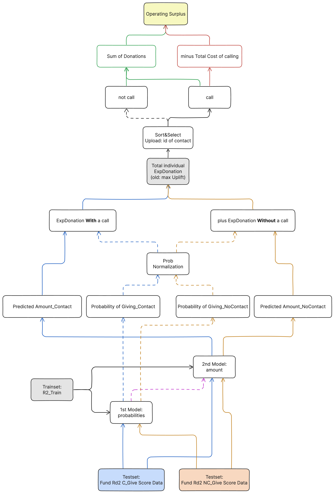

# SAS xCBS Hackathon Season 4

24-27 October 2024

Chulalongkorn Business School & SAS Software (Thailand) Co., Ltd.

- Applied predictive modeling to optimize donor outreach in a direct-contact fundraising campaign.
- Built a 2-stage ensemble model with a pipeline for precise predictions and improved targeting.
- Achieved 4th place by strategically balancing donation forecasts with contact costs.
- Created a new objective function (Total Individual Expected Donation) to maximize operating surplus.

## Overview Diagram


## Directory Structure
```txt
.
├── README.md
├── Resources
│   ├── 2023-05-18_Cortex_with_SAS_Viya.pdf
│   ├── Introduction
│   │   ├── JobAid_Upload_Leaderboard_Cortex.pdf
│   │   ├── MLsasviya.pdf
│   │   └── SAS Skill Builder for Students - Student Guide V4.0.pdf
│   ├── Overview
│   │   └── GameScenario_Fundraising.pdf
│   ├── Round-1
│   │   ├── fundraising_instructions_round_1_viya_4.0.pdf
│   │   └── fundraising_quickguide_round_1_viya_4.0.pdf
│   ├── Round-2
│   │   ├── fundraising_instructions_round_2_viya_4.0.pdf
│   │   └── fundraising_quickguide_round_2_viya_4.0.pdf
│   └── Use the Python SWAT Package on the SAS Viya Platform.ipynb
├── SAS Hackathon 2024.xlsx
├── archive
│   └── catboost_info
│       ├── catboost_training.json
│       ├── learn
│       │   └── events.out.tfevents
│       ├── learn_error.tsv
│       ├── time_left.tsv
│       └── tmp
├── data
│   ├── sasData.zip
│   ├── table_FUNDRAISE_R2_CONTACT_SCOREDATA.csv
│   ├── table_FUNDRAISE_R2_NOCONTACT_SCOREDATA.csv
│   └── table_FUNDRAISE_R2_TRAIN.csv
├── meeting
│   ├── SAS [xCBS] Hackathon - 2024-10-11 E-learning Rev.1.pdf
│   ├── SAS [xCBS] Hackathon - 2024-10-24 Day 2 Round1 Rev.1.pdf
│   └── SAS [xCBS] Hackathon - 2024-10-25 Day 3 Round2 Rev.1.pdf
├── notebooks
│   ├── EDA.ipynb
│   └── main.ipynb
├── plots
│   ├── 1.png
│   ├── 10-log.png
│   ├── 2-cumsumrlzul.png
│   ├── 3.png
│   ├── 4.png
│   ├── 5.png
│   ├── 6.png
│   ├── 7.png
│   ├── 8.png
│   ├── 9.png
│   ├── overview.png
│   └── univariate
└── results
    ├── 20241026_181113-ResultID.csv
    ├── 20241026_181450-ResultID.csv
    ├── 20241026_181727-ResultID.csv
    ├── 20241026_195851-ResultID.csv
    ├── 20241026_200357-ResultID.csv
    ├── 20241026_200702-ResultID.csv
    ├── 20241026_210548-ResultID.csv
    ├── 20241026_212023-ResultID.csv
    ├── 20241027_005508-ResultID.csv
    ├── 20241027_011307-ResultID.csv
    ├── 20241027_041629-ResultID.csv
    ├── 20241027_042818-ResultID.csv
    ├── 20241027_043700-ResultID.csv
    ├── 20241027_044000-ResultID.csv
    ├── 20241027_045000-ResultID.csv
    ├── 20241027_045500-ResultID.csv
    ├── 20241027_045710-ResultID.csv
    ├── 20241027_050000-ResultID.csv
    ├── 20241027_050300-ResultID.csv
    ├── 20241027_050500-ResultID.csv
    ├── 20241027_050700-ResultID.csv
    ├── 20241027_051108-ResultID copy.csv
    ├── 20241027_051108-ResultID.csv
    ├── 20241027_094749-ResultID.csv
    ├── 20241027_094950-ResultID.csv
    ├── 20241027_101028-ResultID.csv
    ├── 20241027_101200-ResultID.csv
    ├── 20241027_101500-ResultID.csv
    ├── 20241027_101600-ResultID.csv
    ├── 20241027_105813-ResultID.csv
    ├── 20241027_110000-ResultID.csv
    ├── 20241027_112456-ResultID.csv
    ├── 20241027_112913-ResultID.csv
    ├── 20241027_114404-ResultID.csv
    ├── 20241027_125046-ResultID copy 2.csv
    ├── 20241027_125046-ResultID copy.csv
    ├── 20241027_125046-ResultID.csv
    └── 20241027_132236-ResultID.csv

16 directories, 118 files
```